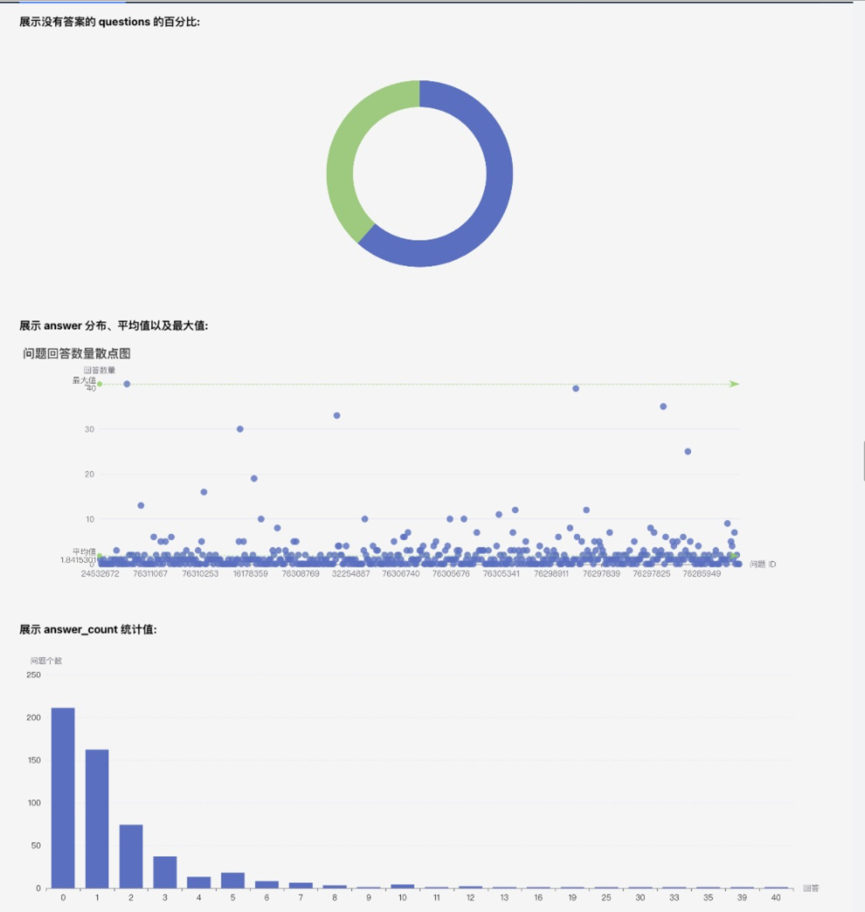
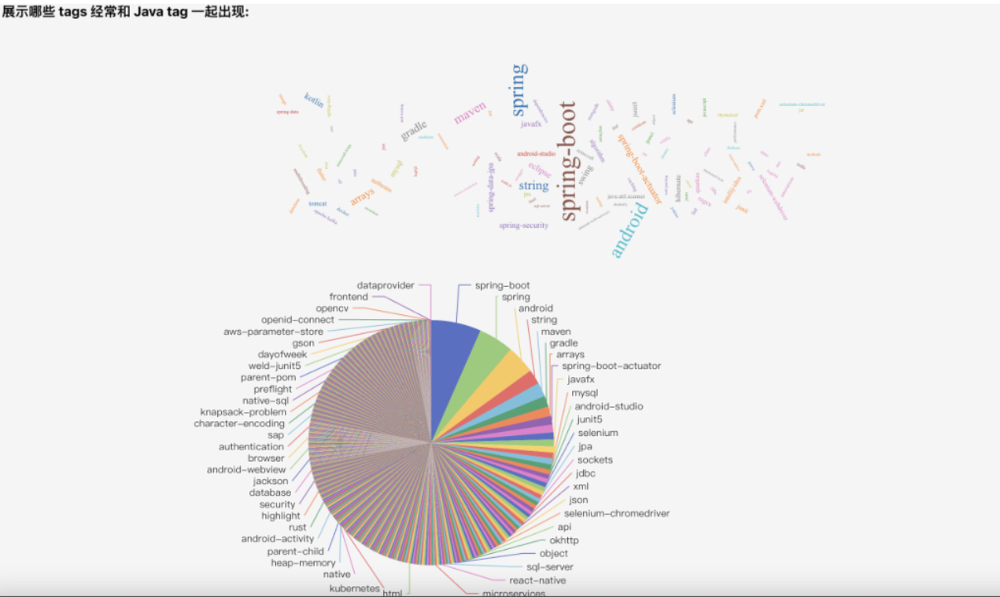
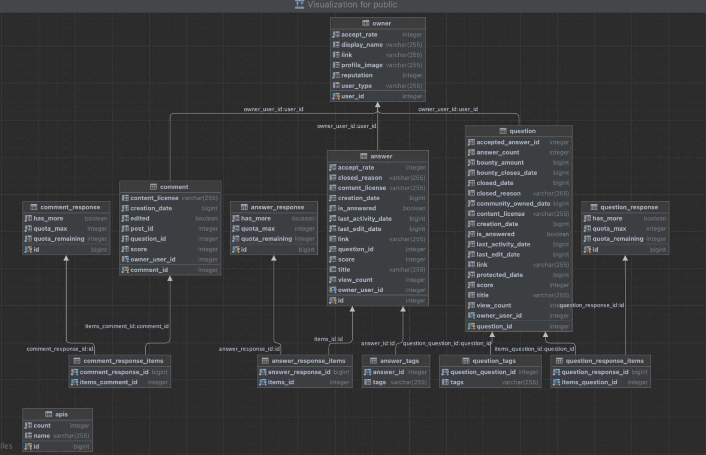
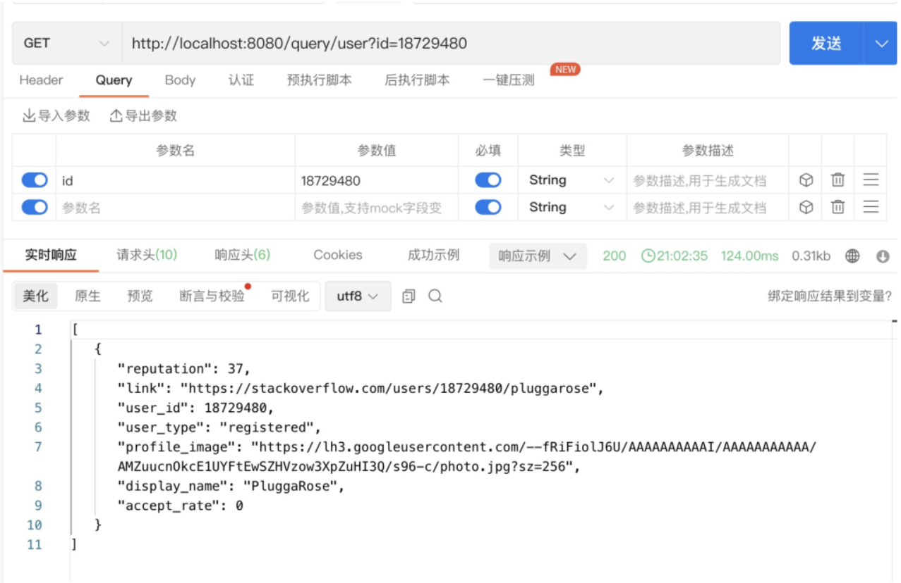
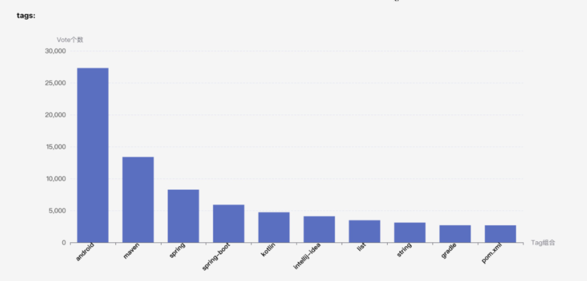
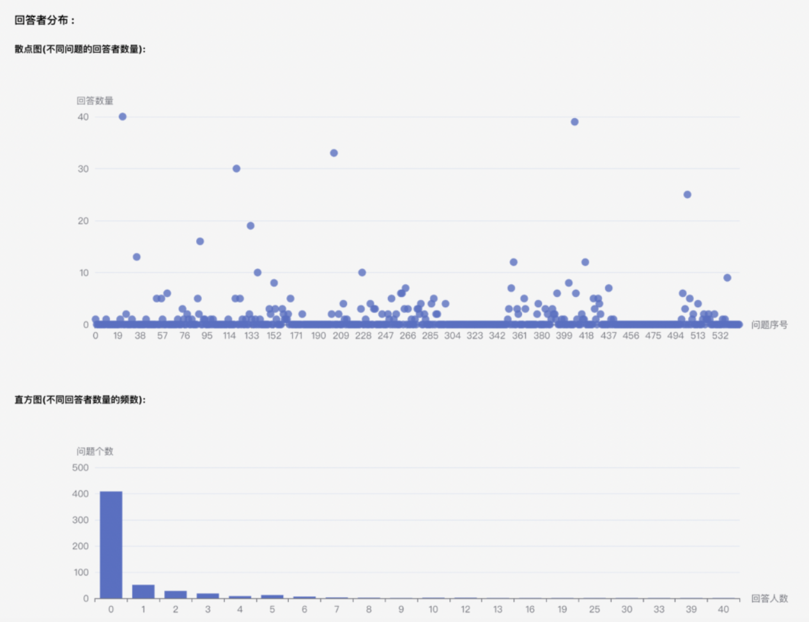
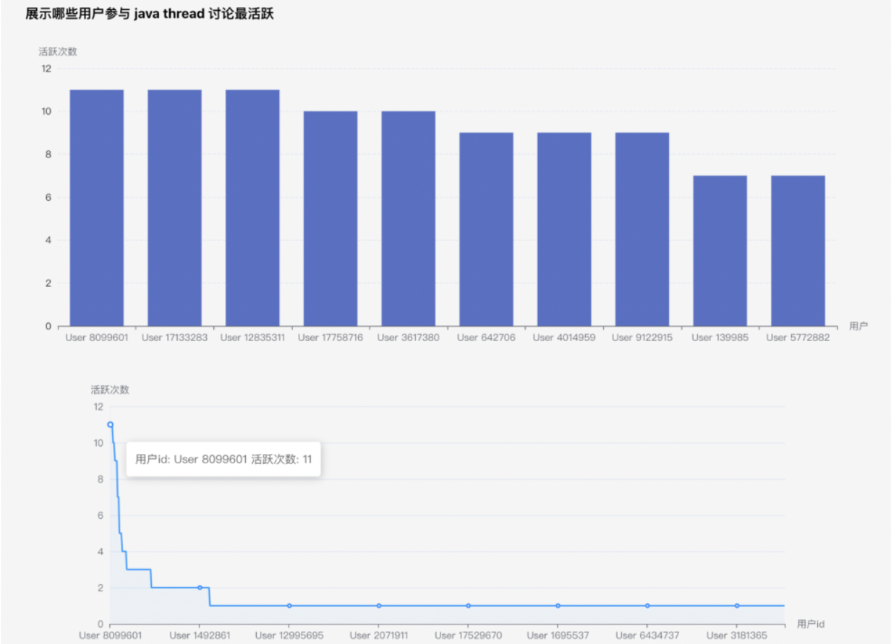

## Stack Overflow Data Crawler

### Introduction

This project aims to scrape data from Stack Overflow for analysis and visualization. The architecture is designed to be robust and scalable, accommodating various types of data and providing insightful visualizations. Here is part of the results.





### Table of Contents

1. Architecture Design
   - Technology Stack
   - Database Design
   - Front End
   - Back End
   - Data Crawling
2. Restful API
3. Insight
4. How to Run the Project

------

### Architecture Design

#### Technology Stack

- **Front End**: React, Axios, echarts
- **Back End**: SpringBoot, JPA
- **Database**: postgreSQL

#### Database Design

- Thread Count: 549



#### Front End

- Interaction implemented using axios for HTTP requests.
- Data visualization using echarts library.

#### Back End

- **Cors Config**: Solves cross-domain issues.
- **Stackoverflow Service**: Responsible for data crawling.
- Various Controllers provide different APIs.

#### Data Crawling

- Utilizes Apache HttpClient for HTTP requests.
- Data is obtained from the official Stack Overflow REST API.
- Data is parsed and saved in the database using JpaRepository.

### Restful API

- We provide Restful API for users.
- We can find answer by questionId, UserId, CommentId or tags. 



### Insight

- 61.57% of questions have answers.
- Most questions can be solved within one day.
- Popular tags include 'Spring Boot', 'spring', 'android'.
- And you can see the rest in the charts provided by the project.








### How to run the project

#### Prerequisites

- Make sure you have Node.js and npm installed for front-end dependencies.
- Java Development Kit (JDK) and Maven for back-end.
- PostgreSQL for the database.

#### Steps

1. **Clone the Repository**

   ```
   bashCopy code
   git clone https://github.com/Sparky579/Stackoverflow-data.git
   ```

2. **Navigate to the Project Directory**

   ```
   bashCopy code
   cd Stackoverflow-data
   ```

3. **Front-End Setup**

   - Navigate to the front-end directory:

     ```
     bashCopy code
     cd front_end
     ```

   - Install the dependencies:

     ```
     Copy code
     npm install
     ```

   - Start the development server:

     ```
     sqlCopy code
     npm start
     ```

4. **Back-End Setup**

   - Navigate to the back-end directory:

     ```
     bashCopy code
     cd ../src/main/java/com/example
     ```

   - Install Maven dependencies:

     ```
     Copy code
     mvn install
     ```

   - Run the Spring Boot application:

     ```
     arduinoCopy code
     mvn spring-boot:run
     ```

5. **Database Setup**

   - Make sure PostgreSQL is running.
   - Tables will be created automatically upon the first run.

6. **Access the Application**

   - Open your web browser and go to `http://localhost:3000` to view the front-end application.
   - The back-end will be running at `http://localhost:8080`.